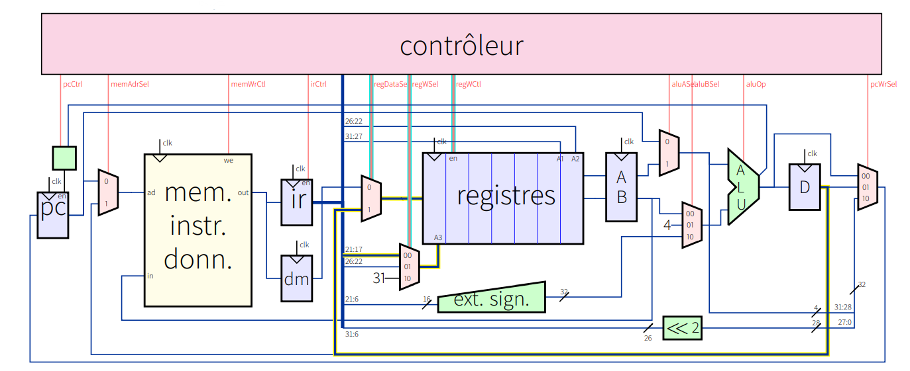

# RISC-V Verilog Processor 

## Vue d'ensemble
Ce projet est une implémentation simple d'un processeur RISC-V utilisant SystemVerilog. Il prend en charge l'ISA RV32I. L'objectif est de créer un cœur synthétisable sur FPGA, optimisé en taille.

## Fonctionnalités
- Implémentation de l'ISA Integer de RISC-V (RV32I).
- Opérations de base de l'ALU.
- Fichier de registres.
- Récupération et décodage des instructions.
- Mémoire unifiée pour les instructions et les données.

## Structure du cœur
Le design est basé sur le cœur présenté dans les cours du professeur Alain Mérigot de l'université Paris-Saclay et s'appuie sur les explications du livre *Computer Organization and Design RISC-V Edition*. Il s'agit d'un cœur RISC-V 32 bits non pipeline avec une mémoire unifiée pour les données et les instructions.

__Figure 1: Cœur RISC-V 32 bits__



## Pour commencer

### Prérequis
- [**oss-cad-suite**](https://github.com/YosysHQ/oss-cad-suite-build) : pour la simulation, la synthèse du design, ainsi que la vérification formelle de chaque élément et la conformité à l'ISA à l'aide de RISCV-formal.
- [**Toolchain GNU GCC RISC-V**](https://github.com/riscv-collab/riscv-gnu-toolchain) : pour compiler le code assembleur de test.

## Structure du répertoire

```plaintext
RISCV-VERILOG-PROCESSOR/
├── Core_design.png
├── RISCV Core.code-workspace
├── Readme.md
├── Scripts
│   ├── ALU_formal.sby
│   ├── dump.vcd
│   ├── run_sim.sh
│   └── simulation.vvp
├── docs
│   ├── Structure Projet.md
│   ├── control.md
│   ├── controlFSM.png
│   ├── controlUnit.png
│   ├── datapath.md
│   └── datapath.png
├── src
│   ├── core
│   │   ├── alu.sv
│   │   ├── control.sv
│   │   ├── core.sv
│   │   ├── datapath.sv
│   │   ├── mux3x1.sv
│   │   ├── register_file.sv
│   │   ├── top.sv
│   │   └── types.sv
│   ├── imem_content
│   │   ├── imem.hex
│   │   └── program.asm
│   └── memory
│       ├── dmem.sv
│       ├── imem.sv
│       └── mem.sv
└── test
    ├── alu_tb.sv
    ├── control_tb.sv
    ├── memory_tb.sv
    └── top_tb.sv
```  
## Licence
Ce projet est sous licence MIT.
pour participer au projet, n'hesitez pas a me contacter directemnet.
## Remerciements
- Professeur Alain Merigot de l'université Paris-Saclay
- [Fondation RISC-V](https://riscv.org/)
- *Computer Organization and Design RISC-V Edition: The Hardware Software Interface* (2nd Edition, 11 décembre 2020) par David A. Patterson et John L. Hennessy. ISBN: 9780128203316 (broché).
- [Chipverify systemVerilog guide](https://www.chipverify.com/tutorials/systemverilog)

