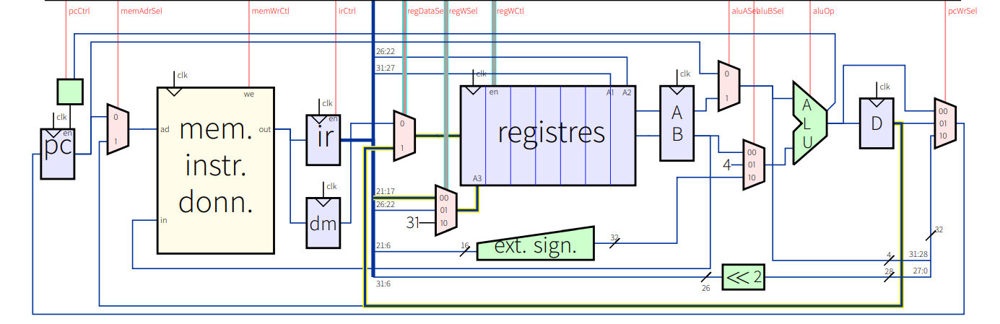

# Conception du Datapath

## Description Fonctionnelle

Le module datapath est le cœur du processeur, facilitant l'exécution des instructions en connectant divers composants tels que l'ALU, le fichier de registres et la mémoire. Ce design est destiné à un processeur **RISC-V** 32 bits.

## Description des Ports

### Entrées :
- **clk** : Signal d'horloge.
- **pcWrSel** : Sélecteur pour la source d'écriture du PC.
- **pcCtrl** : Signal de contrôle du PC.
- **memAdrSel** : Signal de sélection d'adresse mémoire.
- **memWrCtl** : Signal de contrôle d'écriture mémoire.
- **aluOp** : Signal d'opération de l'ALU.
- **aluASel** : Signal de sélection pour l'opérande A de l'ALU.
- **aluBSel** : Signal de sélection pour l'opérande B de l'ALU.
- **regWCtl** : Signal de contrôle pour l'écriture dans un registre.
- **regDataSel** : Sélecteur pour la source des données à écrire dans un registre.
- **regWSel** : Sélecteur pour l'adresse du registre cible.

### Sortie :
- **opALU** : Code opération encodé pour l'ALU.

## Registres Internes et Signaux

### Registres :
- **pc** : Compteur de programme.
- **ir** : Registre d'instructions.
- **dm** : Registre des données de mémoire.
- **a_register** : Registre de l'opérande A de l'ALU.
- **b_register** : Registre de l'opérande B de l'ALU.
- **d_register** : Registre pour le résultat de l'ALU.

### Signaux :
- **pc_write_wire** : Signal pour l'écriture dans le PC.
- **memory_address** : Signal d'adresse pour la mémoire.
- **memory_output** : Données lues depuis la mémoire.
- **registerfile_input** : Données entrantes pour le fichier de registres.
- **alu_operand_a** : Opérande A pour l'ALU.
- **alu_operand_b** : Opérande B pour l'ALU.
- **d_register_write_wire** : Données à écrire dans le registre D.

## Description des Composants

### Compteur de Programme (PC)
Le PC se met à jour en fonction du signal de contrôle `pcCtrl` ou du résultat de l'ALU.  
**Connexion** :  
- `pc_write_wire` détermine la nouvelle valeur du PC.

### Interface Mémoire
L'adresse mémoire est déterminée par `memAdrSel` et connectée soit au PC, soit au registre D. La sortie mémoire est stockée dans les registres IR et DM.

### Fichier de Registres
Le fichier de registres est mis à jour en fonction des signaux de contrôle comme `regWCtl`, `regDataSel` et `regWSel`. Il récupère les données pour les opérandes et écrit les résultats.

### ALU
L'ALU effectue des opérations arithmétiques et logiques en fonction de `aluOp`, `aluASel` et `aluBSel`.

### Multiplexeurs
Plusieurs multiplexeurs contrôlent le flux des données :
- Multiplexeur d'écriture du PC (`pcWrSel`).
- Multiplexeur pour l'opérande B de l'ALU (`aluBSel`).
- Multiplexeur pour l'adresse d'écriture du registre (`regWSel`).

## Tests et Validation

Les tests impliquent la vérification des éléments suivants :
- Mise à jour correcte du PC en fonction de `pcWrSel` et `pcCtrl`.
- Fonctionnalité correcte de lecture/écriture mémoire.
- Opérations précises de l'ALU pour différentes valeurs de `aluOp`.
- Mise à jour correcte du fichier de registres pour tous les signaux de contrôle.

# Conception du Datapath

## Description Fonctionnelle

Le module datapath est le cœur du processeur, facilitant l'exécution des instructions en connectant divers composants tels que l'ALU, le fichier de registres et la mémoire. Ce design est destiné à un processeur **RISC-V** 32 bits.

## Description des Ports

### Entrées :
- **clk** : Signal d'horloge.
- **pcWrSel** : Sélecteur pour la source d'écriture du PC.
- **pcCtrl** : Signal de contrôle du PC.
- **memAdrSel** : Signal de sélection d'adresse mémoire.
- **memWrCtl** : Signal de contrôle d'écriture mémoire.
- **aluOp** : Signal d'opération de l'ALU.
- **aluASel** : Signal de sélection pour l'opérande A de l'ALU.
- **aluBSel** : Signal de sélection pour l'opérande B de l'ALU.
- **regWCtl** : Signal de contrôle pour l'écriture dans un registre.
- **regDataSel** : Sélecteur pour la source des données à écrire dans un registre.
- **regWSel** : Sélecteur pour l'adresse du registre cible.

### Sortie :
- **opALU** : Code opération encodé pour l'ALU.

## Registres Internes et Signaux

### Registres :
- **pc** : Compteur de programme.
- **ir** : Registre d'instructions.
- **dm** : Registre des données de mémoire.
- **a_register** : Registre de l'opérande A de l'ALU.
- **b_register** : Registre de l'opérande B de l'ALU.
- **d_register** : Registre pour le résultat de l'ALU.

### Signaux :
- **pc_write_wire** : Signal pour l'écriture dans le PC.
- **memory_address** : Signal d'adresse pour la mémoire.
- **memory_output** : Données lues depuis la mémoire.
- **registerfile_input** : Données entrantes pour le fichier de registres.
- **alu_operand_a** : Opérande A pour l'ALU.
- **alu_operand_b** : Opérande B pour l'ALU.
- **d_register_write_wire** : Données à écrire dans le registre D.

## Description des Composants

### Compteur de Programme (PC)
Le PC se met à jour en fonction du signal de contrôle `pcCtrl` ou du résultat de l'ALU.  
**Connexion** :  
- `pc_write_wire` détermine la nouvelle valeur du PC.

### Interface Mémoire
L'adresse mémoire est déterminée par `memAdrSel` et connectée soit au PC, soit au registre D. La sortie mémoire est stockée dans les registres IR et DM.

### Fichier de Registres
Le fichier de registres est mis à jour en fonction des signaux de contrôle comme `regWCtl`, `regDataSel` et `regWSel`. Il récupère les données pour les opérandes et écrit les résultats.

### ALU
L'ALU effectue des opérations arithmétiques et logiques en fonction de `aluOp`, `aluASel` et `aluBSel`.

### Multiplexeurs
Plusieurs multiplexeurs contrôlent le flux des données :
- Multiplexeur d'écriture du PC (`pcWrSel`).
- Multiplexeur pour l'opérande B de l'ALU (`aluBSel`).
- Multiplexeur pour l'adresse d'écriture du registre (`regWSel`).

## Tests et Validation

Les tests impliquent la vérification des éléments suivants :
- Mise à jour correcte du PC en fonction de `pcWrSel` et `pcCtrl`.
- Fonctionnalité correcte de lecture/écriture mémoire.
- Opérations précises de l'ALU pour différentes valeurs de `aluOp`.
- Mise à jour correcte du fichier de registres pour tous les signaux de contrôle.

# Conception du Datapath

## Description Fonctionnelle

Le module datapath est le cœur du processeur, facilitant l'exécution des instructions en connectant divers composants tels que l'ALU, le fichier de registres et la mémoire. Ce design est destiné à un processeur **RISC-V** 32 bits.

## Description des Ports

### Entrées :
- **clk** : Signal d'horloge.
- **pcWrSel** : Sélecteur pour la source d'écriture du PC.
- **pcCtrl** : Signal de contrôle du PC.
- **memAdrSel** : Signal de sélection d'adresse mémoire.
- **memWrCtl** : Signal de contrôle d'écriture mémoire.
- **aluOp** : Signal d'opération de l'ALU.
- **aluASel** : Signal de sélection pour l'opérande A de l'ALU.
- **aluBSel** : Signal de sélection pour l'opérande B de l'ALU.
- **regWCtl** : Signal de contrôle pour l'écriture dans un registre.
- **regDataSel** : Sélecteur pour la source des données à écrire dans un registre.
- **regWSel** : Sélecteur pour l'adresse du registre cible.

### Sortie :
- **opALU** : Code opération encodé pour l'ALU.

## Registres Internes et Signaux

### Registres :
- **pc** : Compteur de programme.
- **ir** : Registre d'instructions.
- **dm** : Registre des données de mémoire.
- **a_register** : Registre de l'opérande A de l'ALU.
- **b_register** : Registre de l'opérande B de l'ALU.
- **d_register** : Registre pour le résultat de l'ALU.

### Signaux :
- **pc_write_wire** : Signal pour l'écriture dans le PC.
- **memory_address** : Signal d'adresse pour la mémoire.
- **memory_output** : Données lues depuis la mémoire.
- **registerfile_input** : Données entrantes pour le fichier de registres.
- **alu_operand_a** : Opérande A pour l'ALU.
- **alu_operand_b** : Opérande B pour l'ALU.
- **d_register_write_wire** : Données à écrire dans le registre D.

## Description des Composants

### Compteur de Programme (PC)
Le PC se met à jour en fonction du signal de contrôle `pcCtrl` ou du résultat de l'ALU.  
**Connexion** :  
- `pc_write_wire` détermine la nouvelle valeur du PC.

### Interface Mémoire
L'adresse mémoire est déterminée par `memAdrSel` et connectée soit au PC, soit au registre D. La sortie mémoire est stockée dans les registres IR et DM.

### Fichier de Registres
Le fichier de registres est mis à jour en fonction des signaux de contrôle comme `regWCtl`, `regDataSel` et `regWSel`. Il récupère les données pour les opérandes et écrit les résultats.

### ALU
L'ALU effectue des opérations arithmétiques et logiques en fonction de `aluOp`, `aluASel` et `aluBSel`.

### Multiplexeurs
Plusieurs multiplexeurs contrôlent le flux des données :
- Multiplexeur d'écriture du PC (`pcWrSel`).
- Multiplexeur pour l'opérande B de l'ALU (`aluBSel`).
- Multiplexeur pour l'adresse d'écriture du registre (`regWSel`).

## Tests et Validation

Les tests impliquent la vérification des éléments suivants :
- Mise à jour correcte du PC en fonction de `pcWrSel` et `pcCtrl`.
- Fonctionnalité correcte de lecture/écriture mémoire.
- Opérations précises de l'ALU pour différentes valeurs de `aluOp`.
- Mise à jour correcte du fichier de registres pour tous les signaux de contrôle.

